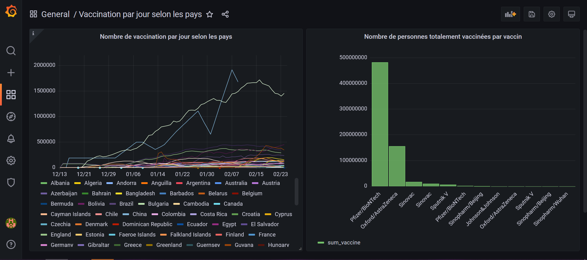

## Installation du dashboard de monitoring

### Deploiement des containers

L'installation du dashboard de monitoring se fait à l'aide de contenaire Docker, et de docker-compose. Après avoir le projet, il suffit de lancer le déploiement avec la commande suivante : `docker-compose up -d`

Cela va créer les deux contenaires nécessaires pour le dashboard de monitoring :
- le contenarires grafana_db, qui est contruit sur une image mysql, et qui va être utilisé pour stocker les données de monitoring. Lors de sa création il va automatiquement créer la base de données à l'aide du fichier vaccination.sql.
- Le conteneur grafana, qui va être utilisé pour afficher le dashboard.

### Configuration de la base de données sur Grafana

La laison entre le dashboard et la base de données doit ête effectuer via l'interface web de Grafana. Pour ce faire il faut ce connecter en tant qu'administrateur, puis aller dans la section "Data Sources" et cliquer sur le bouton "Add". Les champs à remplir sont :
- Type : MySQL
- Name : Vaccination
- Host : grafana_db
- Database : vaccinations
- User : root
- Password : root

### Importation du dashboard à l'aide du fichier dashboards.json

Le Dashboard doit être importé à l'aide du fichier dashboards.json. Pour ce faire il faut se connecter à l'interface web de Grafana, et aller dans la section "Dashboards" et cliquer sur le bouton "Import". Il suffit de sélectionner le fichier dashboards.json tout se mettra en place automatiquement.

## Rendu du dashboard

